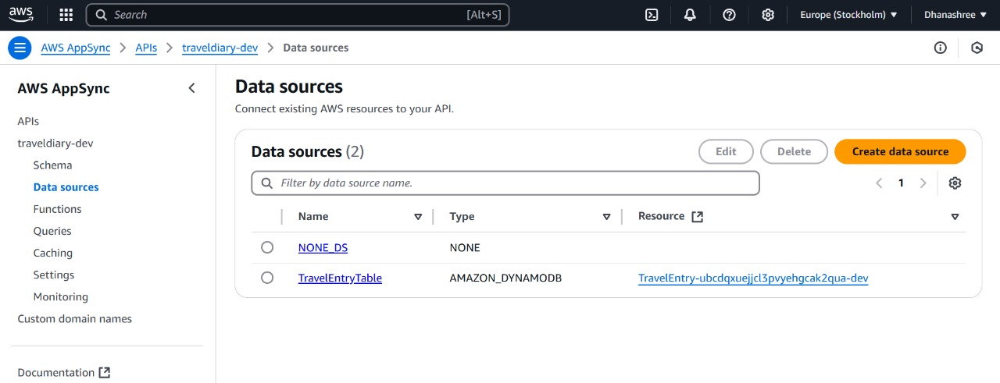
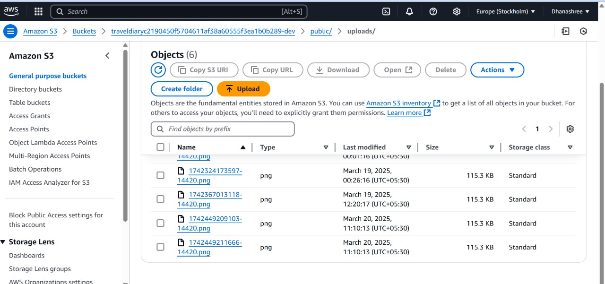
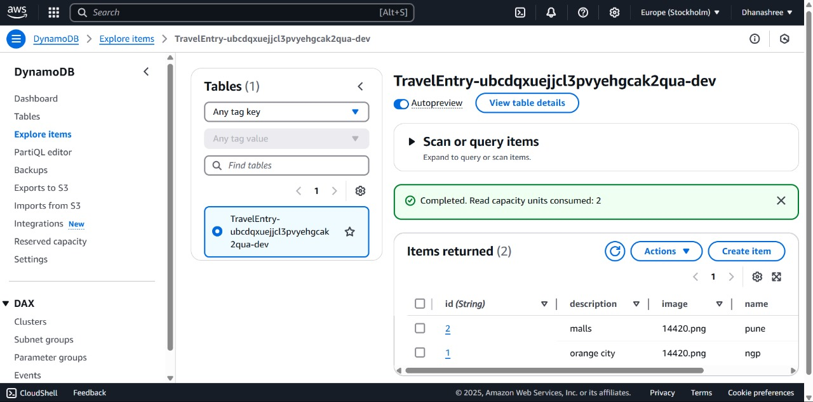
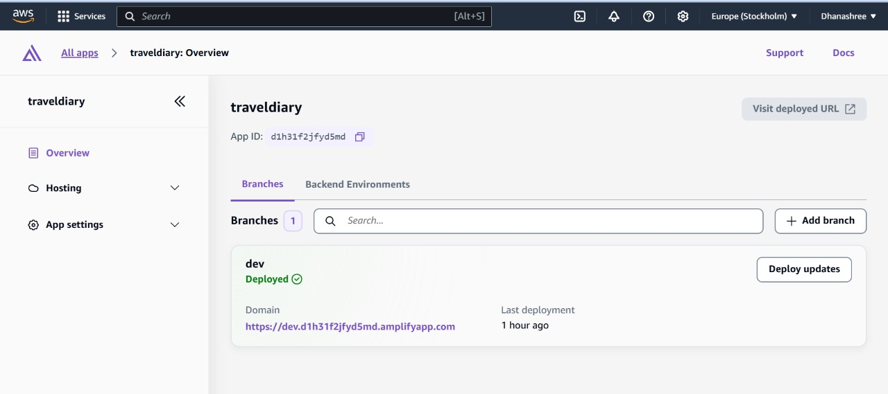
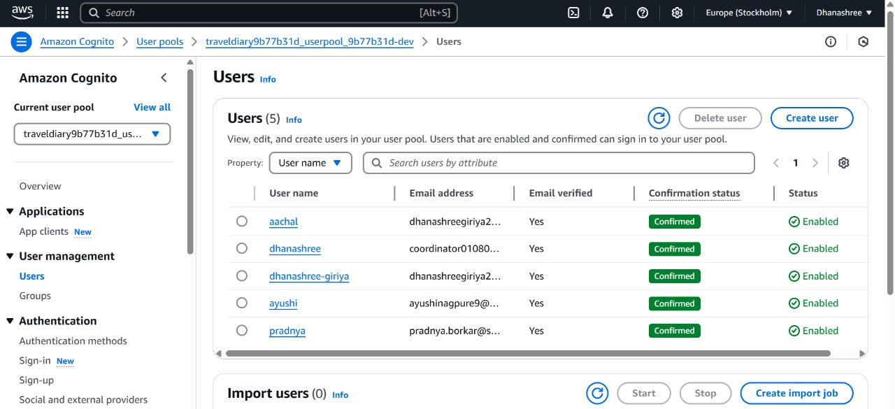
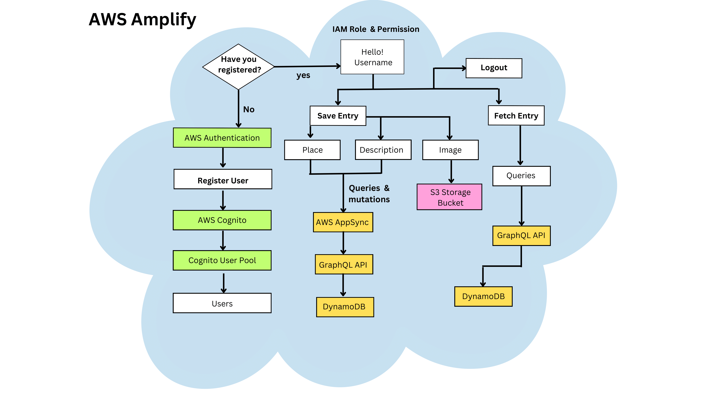

# Cloud-Powered Travel Diary – React & AWS Amplify

## Overview
This project is a full-stack travel diary application built with **React.js** for the frontend and **AWS Amplify** for backend services. Users can log in, add travel entries (place, description, image), store data in **Amazon DynamoDB**, and retrieve it dynamically.

By leveraging **AWS Amplify**, we eliminated the need for complex backend management, making deployment and scaling easier. The project demonstrates how **cloud-native applications** can simplify full-stack development and improve user experience.

## 🚀 Features
- **User Authentication** using **AWS Cognito**
- **GraphQL API** Integration with **AWS AppSync**
- **Cloud Database Storage** using **Amazon DynamoDB**
- **Secure Image Uploads** via **Amazon S3**
- **Seamless Backend Integration** with **AWS Amplify**
- **Deployed on AWS** using **Amplify Hosting**
- **Responsive UI** with modern React components
- **Lazy Loading for Images** to improve performance
- **Optimized State Management** using React Context API
- **Offline Support** via AWS Amplify's offline capabilities

## 🛠 AWS Resources Used
### 1️⃣ AWS AppSync (GraphQL API)

Facilitates communication between the frontend and backend. GraphQL queries and mutations allow fetching and updating data efficiently compared to traditional REST APIs.

### 2️⃣ Amazon S3 Bucket

Used for securely storing images uploaded by users. When an image is uploaded, its URL is stored in DynamoDB, making it easy to retrieve and display later.

### 3️⃣ Amazon DynamoDB Table

A NoSQL database used to store travel entries. Each entry contains place, description, user, and image URL. DynamoDB offers high scalability and low-latency performance.

### 4️⃣ AWS Amplify Hosting

Used to deploy and host the React application on AWS, providing a fast and scalable frontend hosting solution.

### 5️⃣ Amazon Cognito Users

Handles user authentication, allowing secure signup, login, and session management. Cognito manages authentication flows, removing the need for custom authentication logic.

## 🔄 Dataflow Diagram


## 📡 GraphQL Queries & Mutations

### 🔹 Query to Fetch Travel Entries
Retrieves all saved travel entries from DynamoDB:
```graphql
query ListTravelEntries {
  listTravelEntries {
    items {
      id
      place
      description
      imageUrl
    }
  }
}
```

### 🔹 Mutation to Save a Travel Entry
Adds a new travel entry to the database:
```graphql
mutation CreateTravelEntry($input: CreateTravelEntryInput!) {
  createTravelEntry(input: $input) {
    id
    place
    description
    imageUrl
  }
}
```

## 🏗 Tech Stack
- **Frontend:** React.js, CSS, Material UI
- **Backend:** AWS Amplify, AWS AppSync (GraphQL), AWS Cognito
- **Database:** Amazon DynamoDB
- **Storage:** Amazon S3
- **Hosting:** AWS Amplify Hosting

## 🛠 Setup & Installation

### 1️⃣ Clone the Repository
```bash
git clone https://github.com/yourusername/travel-diary.git
cd travel-diary
```

### 2️⃣ Install Dependencies
```bash
npm install
```

### 3️⃣ Configure AWS Amplify
```bash
amplify configure
amplify init
amplify push
```

### 4️⃣ Run the Application
```bash
npm start
```
The app will be available at **http://localhost:3000/**.

## 📌 Deployment
To deploy the application using AWS Amplify Hosting:
```bash
amplify add hosting
amplify publish
```
This generates a **live URL** for the application.

## 📝 License
This project is open-source and available under the **MIT License**.

## 📩 Contact
For any questions or collaboration:
📧 **Email:** dhanashreegiriya2013@gmail.com
🔗 **GitHub:** [dhanashree010804](https://github.com/dhanashree010804)
